# ORACLE: Paper Draft
## JBI Submission Target Sep 22 2026
## Abstract

Retrieval-augmented generation systems retrieve identically for every user regardless of literacy level, and prior work treats accessibility as a post-generation simplification step, which introduces factual errors absent from the original source context. We present ORACLE, a system that conditions dense retrieval directly on an estimated literacy band via hard candidate-pool selection, paired with band-specific generation prompting. Evaluated across five corpus sources (36,664 records: MedMCQA, MedQA, MIRAGE, PubMedQA, PLABA), correct literacy-band routing significantly improves generation readability (Wilcoxon, n=177, p=0.0018) but produces no measurable effect on retrieval relevance or content fidelity, a bounded, falsifiable claim about which pipeline stage literacy conditioning actually affects. Factual consistency is evaluated two independent ways; the two scores diverge substantially, traced to a genuine domain mismatch in the official metric's knowledge base rather than a pipeline error. APPLS-based perturbation testing on our own data confirms ROUGE-L and BERTScore are sensitive to the transformations this evaluation cares about, while FK shows only weak, sample-size-dependent sensitivity. A self-retrieval evaluation, controlled for candidate-pool size, finds a genuine retrieval-quality advantage in the low-literacy band that survives two tested explanations and remains an open question. Comprehension-outcome measurement, whether improved readability improves actual understanding, is not attempted here and is identified as necessary future work alongside integrating MedQuAD, the corpus's most directly patient-facing excluded source.

---

## 1. Introduction

### 1.1 The Health Information Accessibility Gap

A retrieval-augmented generation system deployed for a healthcare client illustrates the gap this paper addresses. Retrieval was accurate by every standard information-retrieval metric, yet the system was failing the patients using it. Four failure modes recurred, each traceable to the same root cause: the system had no representation of who was asking. The first was a readability mismatch. A clinician's question and a newly diagnosed patient's question, phrased identically in structure, retrieved the same source material and received the same register of response, regardless of which of the two actually asked it. The second was literacy drift across a conversation: a user's own phrasing shifts turn to turn, sometimes becoming more technical as they pick up vocabulary from the system's own prior responses, sometimes staying simple, and a system with no persistent literacy estimate treats every turn as an independent event rather than tracking where a user actually is. The third was a factuality-accessibility inversion, simplifying an already-generated response to make it more readable introduced factual errors that were not present in the original retrieved content, because the simplification step had no access to the retrieval context that justified the original claim. The fourth, and the one that motivates this paper's specific design choice, was architectural: all three of the above were symptoms of treating accessibility as something applied after generation rather than something conditioned into retrieval itself, at the point where the system first decides what content a user will see.

The population affected by this gap extends beyond patients directly. Family members navigating discharge instructions on a relative's behalf, non-native English speakers translating medical concepts into an unfamiliar language while also parsing new medical vocabulary, and caregivers reading under acute stress all depend on the same retrieval pipeline producing content they can actually use, and none of them are represented by a system that retrieves identically for every query.

### 1.2 The Literacy-Agnostic Retrieval Problem

Every major retrieval-augmented generation system retrieves on semantic similarity alone. The foundational architecture, established by Lewis et al. (2020), rests on dense passage retrieval as formalized by Karpukhin et al. (2020) and was later extended with multi-passage fusion by Izacard and Grave (2021). Whether retrieved content suits a given user's literacy level is a question none of these systems can answer, since none were built to ask it. Treating simplification as a post-hoc step applied after generation does not resolve this gap; You and Guo (2026) documented that this approach introduces factual errors, since simplification performed on already-generated content lacks access to the source material's full context. The correct point to intervene is upstream, at retrieval, not downstream, after generation has already committed to a specific framing of the content.

### 1.3 ORACLE Contributions

This paper makes three contributions. First, ORACLE is the first system, to our knowledge, to condition dense retrieval directly on an estimated literacy band via hard band selection, restricting the retrieval candidate pool itself rather than filtering or re-ranking results after an undifferentiated search. Second, we provide an empirical resolution of what literacy-band routing actually affects: correct routing significantly improves generation readability, but does not measurably affect retrieval relevance or generation content fidelity by the metrics evaluated here, a bounded and falsifiable claim rather than an unqualified assertion that routing accuracy matters. Third, we report two independently computed factual-consistency scores for the same generation pipeline, an adapted method and the official PlainQAFact metric, and show that their substantial divergence is itself informative, tracing to a genuine domain mismatch between PlainQAFact's underlying knowledge base and this corpus's clinical-trial-specific content rather than to a pipeline error.

### 1.4 Paper Organization

The remainder of this paper proceeds as follows. Section 2 reviews related work in RAG foundations, biomedical question-answering benchmarks, plain-language and health-literacy research, and health-literacy measurement frameworks. Section 3 covers ORACLE's methodology, spanning the four-stage pipeline, the retrieval corpus, literacy-band classification, the retrieval and generation mechanism, and the evaluation metrics. Experimental setup and reproducibility follow in Section 4. Section 5 reports results, Section 6 discusses their implications, and Section 7 closes the paper.

## 2. Related Work

### 2.1 RAG Foundations

Lewis et al. (2020) combined a parametric generation model with a non-parametric retrieval step, grounding generation in retrieved evidence instead of relying solely on a model's internal parameters. Retrieval in this architecture is literacy-agnostic by design: a single pass, conditioned only on the query's semantic content, serves every user the same way, since nothing in the query encoding captures who is asking or what they're able to parse. Karpukhin et al. (2020) formalized dense passage retrieval as the encoder architecture underlying this approach, mapping queries and documents into a shared vector space and ranking candidates by similarity within that space. ORACLE builds directly on this backbone but intervenes at two specific points Karpukhin et al.'s original formulation does not address: the query encoding step, where a literacy band is estimated before retrieval runs, and the candidate-pool selection step, where the search space itself is restricted to that band rather than searched in full and filtered afterward. Izacard and Grave (2021) introduced Fusion-in-Decoder, improving how a generation model synthesizes evidence across multiple retrieved passages rather than conditioning on a single best match. This is a genuine advance for generation quality, but it inherits the same literacy-agnostic retrieval stage as Lewis et al.'s original formulation: better fusion of retrieved passages does not address which passages were retrievable in the first place, which is precisely the stage ORACLE modifies.

### 2.2 Biomedical QA Benchmarks

PubMedQA (Jin et al., 2019) evaluates yes/no/maybe reasoning over biomedical research abstracts; MedMCQA (Pal et al., 2022) and MedQA (Jin et al., 2021) are drawn from medical school and licensing examination questions; MIRAGE (Xiong et al., 2024) is purpose-built as a RAG-specific medical benchmark and is, as of this writing, the strongest available benchmark for evaluating retrieval quality in a medical context specifically. All four share a common property directly relevant to this paper: they test clinical professional knowledge, examination-style reasoning and research literacy, not whether a lay reader can understand and act on the information retrieved. MIRAGE's strength as a retrieval benchmark makes this gap more consequential rather than less, since it means the field's best available tool for evaluating medical RAG retrieval quality has no accessibility dimension built in at all; a system could score well on MIRAGE while retrieving content no patient could use. This gap in the benchmark landscape is directly relevant to Section 3.2's corpus composition and Section 6.3's discussion of production deployment implications, since a corpus assembled from these same four sources, as this paper's is, inherits their clinical-professional skew unless a genuinely patient-facing source is deliberately included alongside them.

### 2.3 Plain Language and Health Literacy

You and Guo (2026) introduced PlainQAFact, documenting the factuality-accessibility inversion that anchors this paper's design rationale: simplification performed without access to full source context introduces factual errors. Guo et al. (2024) demonstrated that jargon identification requires personalization rather than universal dictionaries, informing this paper's per-band conditioning design. A separate work by Guo et al. (2024), APPLS, showed that standard readability and content metrics fail to predict actual comprehension, motivating the metric-validation approach in Section 5.5 rather than relying on citation-based justification alone. Attal et al. (2023) produced PLABA, a gold-standard dataset of plain-language biomedical adaptations, used here as the corpus's primary accessibility-focused evaluation source.

### 2.4 Health Literacy Frameworks

Nutbeam (2000) established a three-level health-literacy classification, which this paper's four-band design operationalizes at finer granularity. Baker (2006) demonstrated that health literacy predicts health outcomes independently of education or income, establishing that literacy is a distinct construct rather than a proxy for general education level. The Institute of Medicine (2004) estimated that 36% of US adults have basic or below-basic health literacy, the scale of the population this paper's retrieval-conditioning approach is intended to serve.

## 3. Methods

### 3.1 Framework Overview

ORACLE addresses literacy-agnostic retrieval through a four-stage pipeline: document ingestion with literacy scoring, retrieval restricted to a literacy-band-specific candidate pool via hard band selection, band-conditioned generation, and readability and content-fidelity evaluation. This architecture reflects a specific design choice: literacy conditioning happens upstream, at the retrieval stage, rather than downstream, as a post-processing simplification step applied after generation. You and Guo (2026) documented that post-hoc simplification introduces factual errors precisely because it operates on already-generated content without access to the original source material's full context; conditioning retrieval itself on literacy band avoids this failure mode by ensuring the system never retrieves content it will need to distort.

### 3.2 Retrieval Corpus

The retrieval corpus draws on five sources: MedMCQA, MedQA, MIRAGE, PubMedQA, and PLABA, totaling 36,664 records after processing. Table 1 summarizes the corpus composition by source.

| Source | Records | Corpus Share |
|---|---|---|
| MedMCQA | 15,732 | 42.9% |
| MedQA | 11,431 | 31.2% |
| MIRAGE | 7,580 | 20.7% |
| PubMedQA | 1,000 | 2.7% |
| PLABA | 921 | 2.5% |

**Table 1.** Corpus composition by source, five datasets totaling 36,664 records.

MedMCQA required explicit correction before inclusion. MedMCQA in its raw form contributes 193,155 records, 89.9% of the combined corpus, enough to crowd out every other source entirely. A cap of 20,000 records was therefore applied, using stratified sampling across MedMCQA's 21 medical subject categories so subject-level diversity would be preserved rather than sampled uniformly at random. This stratified step alone brings the source to approximately 20,000 records; a subsequent minimum-length quality filter, applied identically across all five sources, removes records with fewer than 20 characters of question text, reducing MedMCQA's final contribution to 15,732 records, 42.9% of the finished corpus. No single source exceeds half of the total, a deliberate outcome of the capping decision rather than an incidental property of the raw data.

MedQuAD, a genuinely patient-facing question-answer dataset with 47,441 records, was evaluated for inclusion and excluded. The publicly available HuggingFace version of MedQuAD has a substantial null-answer problem affecting the majority of records; a usable subset of approximately 16,407 records with genuine, non-null answers does exist within the dataset, but integrating that subset was not completed before this corpus was finalized. This exclusion is a real limitation of the current corpus, since MedQuAD is the one source in this space designed explicitly for patient-facing question answering rather than clinical assessment; its absence is addressed directly in Section 6.4 and logged as future work rather than treated as a settled decision.

### 3.3 Literacy Band Classification

On ingestion, every document and query is scored using Flesch-Kincaid grade level and assigned to one of four discrete bands: low (FK ≤ 6, plain language), medium (FK 7-10, general public), high (FK 11-14, educated layperson), and clinical (FK 15+, clinical professional), a finer-grained operationalization of Nutbeam's (2000) three-level literacy framework.

FK is an imperfect proxy by construction: it captures surface features, sentence length and syllable count, not vocabulary difficulty or domain-specific jargon. This produces a documented, unmitigated failure mode in the corpus itself. MedMCQA, composed of short clinical exam-stem fragments, contributes 80.3% of all low-band-classified records despite containing dense medical terminology inappropriate for a genuinely low-literacy reader; PLABA, the one corpus source that is actual gold-standard plain-language writing, contributes zero low-band records. A classifier scoring surface complexity cannot distinguish a short, jargon-dense exam question from a genuinely accessible sentence of similar length.

### 3.4 Retrieval and Generation

Literacy conditioning is enforced at the retrieval stage through hard band selection, not post-hoc re-ranking. Each incoming query is first classified into a literacy band; retrieval then searches only the embedding pool for that band, so a query classified as low-literacy can only retrieve low-band documents, never a higher-band document later filtered or demoted. This is a stronger conditioning mechanism than re-ranking: literacy-inappropriate content is structurally unreachable at retrieval time rather than deprioritized after the fact. The system also supports an explicit band override, used to force retrieval from a specified band independent of the query's own classified band, supporting the literacy-correction evaluation described in Section 5.6.

Retrieval itself uses a DPR backbone (Karpukhin et al., 2020), with queries and documents encoded into a shared vector space and ranked by cosine similarity within the selected band's pool. Generation runs on gpt-4o-mini, selected for cost efficiency and to reflect realistic production-deployment constraints: a full evaluation set runs at approximately $2-3, a cost low enough that an organization could plausibly deploy this system rather than requiring research-grade compute budgets. Literacy conditioning at the generation stage is implemented through band-specific system prompts, a distinct system prompt template per band, combined with the retrieved documents to construct the final generation prompt. A parallel PEFT/LoRA adapter architecture was also built and structurally validated per band as an alternative to prompt-based conditioning; it is not the mechanism producing the results in Section 5 and is discussed further in Section 6.4.

### 3.5 Evaluation Metrics

Retrieval quality is evaluated via self-supervised retrieval: each record's own question is used as a query, and the record's own record_id serves as its ground-truth relevant document, since it is definitionally the source the question was drawn from. This design permits standard information-retrieval metrics, Precision@1, Recall@K, and Mean Reciprocal Rank, evaluated separately within each literacy band's embedding pool. This measures whether the system can recover a record's source given its own question; it is a distinct and narrower guarantee than Precision@K measured against independently human-annotated relevance judgments, since only one document is treated as relevant per query by construction. Band-routing accuracy on a fixed 20-query evaluation set (5 per band), source diversity of retrieved documents, and FK-grade alignment between query and retrieved content are reported alongside these metrics as further proxies for retrieval behavior.

Factual consistency is evaluated two ways: an adapted GPT-4o-mini method using source-abstract ground truth, and the official PlainQAFact metric (You & Guo, 2026), reported together with an explanation of what each measures rather than treated as interchangeable. Readability is measured via FK and SMOG, reported for comparability but not treated as the study's primary evidence on their own. Generation quality is measured via ROUGE-L and BERTScore. APPLS-based perturbation testing (Section 5.5), applied directly to ORACLE's own PLABA test split, empirically confirms that ROUGE-L and BERTScore are strongly sensitive to the informativeness, coherence, and simplification transformations this pipeline cares about; FK shows small, only statistically-significant-at-scale sensitivity to the same transformations and does not meet the threshold this evaluation treats as meaningful, capturing a substantially weaker signal than ROUGE-L or BERTScore for these transformations.

The central empirical claim of this evaluation is precisely scoped, not sweeping: correct literacy-band routing measurably improves readability outcomes (Section 5.3), and produces no measurable effect on retrieval relevance or generation faithfulness by the metrics available here. Comprehension-outcome measurement against genuine human task success is identified as necessary future work (Section 6.4) and was not attempted in the current evaluation.

## 4. Experimental Setup

### 4.1 Implementation

All experiments were implemented in Python 3.11.9. Dense passage retrieval uses the facebook/dpr-question_encoder-single-nq-base query encoder via Hugging Face transformers (4.57.6) and torch (2.10.0). Generation uses gpt-4o-mini via the OpenAI API (openai 2.29.0). Factual consistency and generation-quality evaluation use rouge_score (0.1.2) and bert-score (0.3.13). The unused PEFT/LoRA architecture noted in Section 3.4 uses the peft library (0.20.0).

MIMIC-III access, intended for a future patient-to-clinical comparison extension of this work, remains at the design stage: it appears in internal design documentation as a planned direction, but no data loader or integration exists in the current codebase. This distinction is stated plainly here since it affects what "future work" can concretely mean for MIMIC-III in Section 6.4: integration has not yet begun at any level.

### 4.2 Reproducibility

All code, corpus construction scripts, evaluation scripts, and generated figures are available in the project repository. The retrieval corpus (`oracle_corpus.csv`) and all downstream evaluation outputs, including cross-dataset routing and readability results, factual consistency scores, and self-retrieval evaluation results, are committed alongside the scripts that produced them. A known source of non-determinism exists at the generation stage: repeated calls to gpt-4o-mini at temperature=0 do not guarantee bit-identical outputs across runs, confirmed directly during this paper's drafting when independently re-running the Section 5.3 significance test returned a closely comparable but not identical result (p=0.0018, n=177) to an earlier snapshot (p=0.0012, n=181) computed from the same underlying methodology. The qualitative pattern, that correct routing significantly improves readability without affecting content metrics, held identically across both computations; the specific point estimates should be read as reproducible in direction and approximate magnitude, not as exact, bit-for-bit reproducible values.

## 5. Results

### 5.1 Corpus Composition and Literacy Distribution

Table 2 summarizes the corpus's literacy-band distribution.

| Band | Records | Corpus Share |
|---|---|---|
| Medium | 14,798 | 40.4% |
| High | 12,281 | 33.5% |
| Clinical | 5,321 | 14.5% |
| Low | 4,264 | 11.6% |

**Table 2.** Literacy-band distribution across the 36,664-record corpus.

The low band's composition reveals a documented, unmitigated failure mode of FK-based classification. MedMCQA, composed of short clinical exam-stem fragments, contributes 80.3% of all low-band-classified records despite containing dense medical terminology inappropriate for a genuinely low-literacy reader. PLABA, the corpus's one source of actual gold-standard plain-language writing, contributes zero low-band records; its content style does not register as "low" under a metric scoring only sentence length and syllable count.

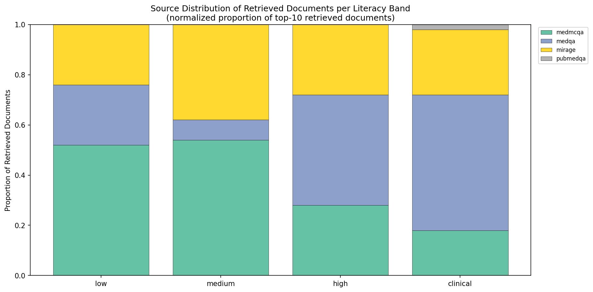

**Figure 1.** Distribution of corpus records by source.

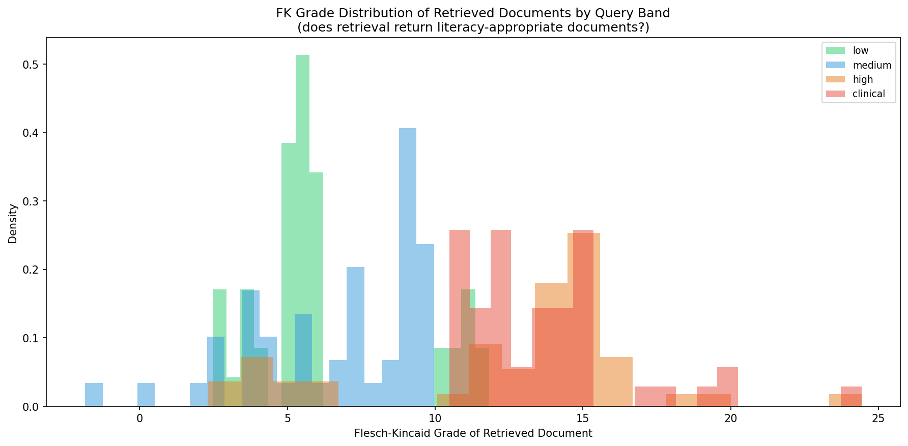

**Figure 2.** Distribution of Flesch-Kincaid grade scores across all corpus records, the basis for literacy-band assignment.

### 5.2 Literacy-Band Routing Accuracy by Source

Routing accuracy, whether a query's estimated literacy band correctly matches its true source band, varies sharply by source rather than holding uniform across the corpus. On a 523-query evaluation set: MedMCQA and PLABA route correctly 100% of the time; MedQA routes correctly 73.0%; PubMedQA 44.7%; PubMed 42.7%; Mirage only 32.0%, the weakest of any source. This spread is large enough that a single blended routing-accuracy figure would misrepresent every individual source; identifying the specific source-level property driving this variation, beyond the corpus-composition and length factors ruled out elsewhere in this paper, is left as a direction for future investigation rather than claimed here.

Self-retrieval evaluation, using each record's own question as its query and its own record_id as ground truth, was run on a stratified sample of 300 records per literacy band (1,200 total) rather than the full corpus, for computational feasibility; a full-corpus run was estimated at approximately 2.7 hours given the pipeline's current unoptimized similarity search.

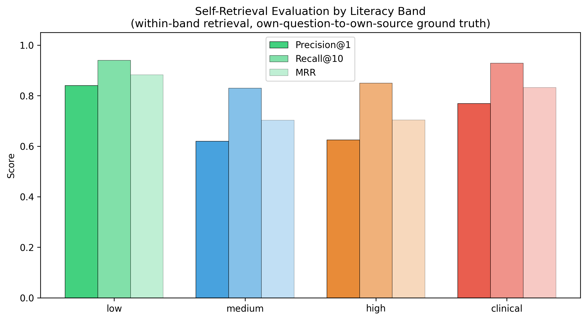

**Figure 3.** Self-retrieval evaluation by literacy band using each band's true, as-deployed candidate pool size (low=4,264; medium=14,798; high=12,281; clinical=5,321). Low band shows the strongest scores, but its candidate pool is also the smallest.

To isolate genuine retrieval-quality differences from candidate-pool-size effects, a second evaluation fixes the candidate pool to 4,264 records per query for every band, always including each query's own true source record.

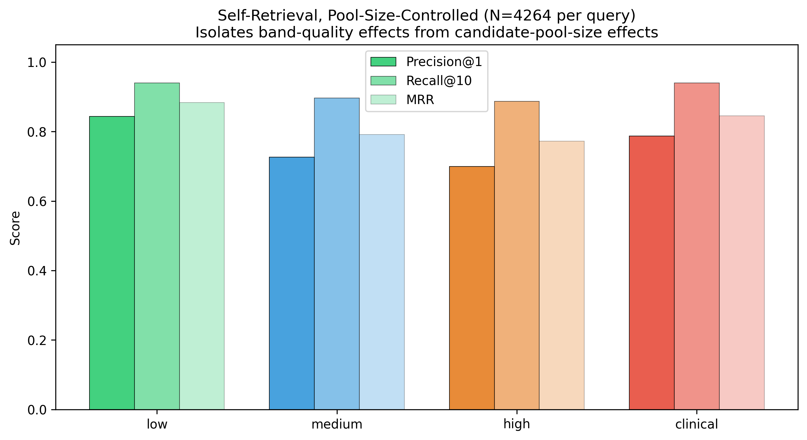

**Figure 4.** Pool-size-controlled self-retrieval evaluation, fixed candidate pool of 4,264 per query. Even with pool size held constant, low band keeps its edge, Precision@1 0.843 against 0.687-0.727 elsewhere, so the difference by band looks real rather than an artifact of pool size. A natural hypothesis that MedMCQA's short, distinctive questions (79.7% of the low band) drive this advantage does not hold: MedMCQA's own within-band Precision@1 (0.816) falls slightly below the band average, while Mirage, a minority source in this band (19.3%), retrieves at 0.966. The low band's aggregate advantage is not explained by its dominant source; it is better explained, provisionally, by Mirage's unusually strong retrievability specifically, a pattern this evaluation surfaces but does not yet explain.

### 5.3 Routing Accuracy and Readability Outcomes

Correct literacy-band routing significantly improves generation readability. Hold the retrieved context fixed and vary only whether the generation prompt used the wrong band or the correct one, the "upper bound" condition, and a clear split emerges. FK reduction moves significantly with routing correctness (Wilcoxon, n=177, wrong-band mean=-4.102, correct-band mean=-2.969, p=0.0018). ROUGE-L and BERTScore don't move at all (n=180, p=0.640 and p=0.937). The design predicts exactly this: with retrieved content identical in both conditions, only the prompt's band instruction changes, so only the metric that instruction actually shapes, readability, has anything to respond to. Content-level metrics simply have no path by which routing correctness could touch them.

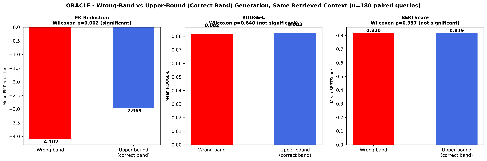

**Figure 5.** Wrong-band versus upper-bound (correct-band) generation on identical retrieved context, compared across FK reduction, ROUGE-L, and BERTScore.

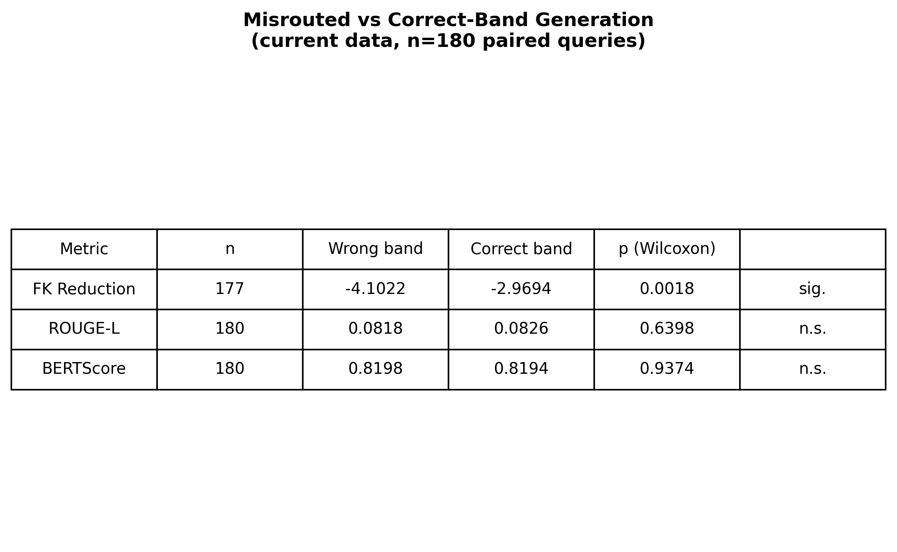

**Figure 6.** Wilcoxon significance summary for the wrong-band versus correct-band comparison across all three metrics.

### 5.4 Factual Consistency Evaluation

Factual consistency is evaluated two ways on a 20-record test set. An adapted method, scoring each record against its own source abstract with GPT-4o-mini, reports overall consistency at 0.969. Simplification claims score higher (0.983) than elaboration claims (0.870), echoing PlainQAFact's own finding: the generation process holds onto factual content more reliably while compressing information than while adding detail beyond the source.

The official PlainQAFact metric (You and Guo, 2026), which uses external knowledge-base retrieval rather than the source abstract as its ground truth, was run separately and reports a substantially different overall score of approximately 0.33 (external-knowledge-base mean approximately 0.26). This official evaluation requires a locally hosted Llama 3.1 8B Instruct model on 40GB or more of CUDA-capable GPU memory; it was run in a separate environment meeting that requirement, since the primary development machine (Apple Silicon, no CUDA) cannot run it directly. The two scores are not measuring the same thing and are not in tension: the adapted method asks whether generated content is consistent with its own cited source, while the official metric asks whether it is consistent with an external medical knowledge base, and a domain mismatch between that knowledge base's coverage (general medical education content) and this corpus's clinical-trial-specific claims plausibly explains much of the gap. Both scores are reported for this reason, rather than treating either as the single correct measurement.

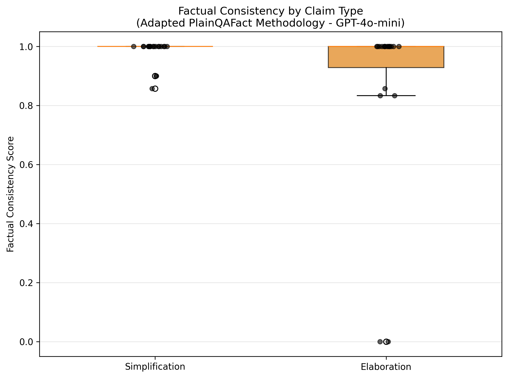

**Figure 7.** Adapted-method factual consistency scores, simplification versus elaboration claims.

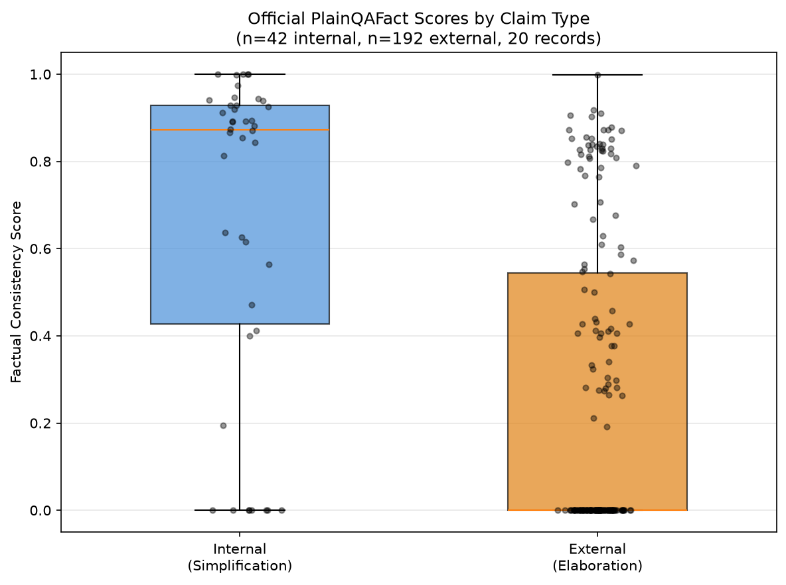

**Figure 8.** Official PlainQAFact factual consistency scores, simplification versus elaboration claims.

### 5.5 APPLS-Based Metric Validation

Three perturbation types, informativeness (delete_sentence), coherence, and simplification, were applied to ORACLE's own data and each metric's correlation with the perturbation's severity was measured. ROUGE-L and BERTScore show large, consistent sensitivity across all three perturbation types (|r| = 0.63-0.98, p<0.001 in every case). FK's correlations are statistically significant in all three tests as well (p<0.003 in every case), a product of the large sample sizes involved (n=1,386-1,613), but its effect sizes are small (|r| = 0.08-0.28) and fall below the 0.3 threshold this evaluation treats as meaningful sensitivity, while ROUGE-L and BERTScore clear that threshold by a wide margin in every test. FK is therefore better described as largely, not completely, insensitive to these perturbations: technically detectable given enough data, but not sensitive enough to serve as a reliable signal for the transformations this pipeline cares about, in contrast to ROUGE-L and BERTScore's unambiguous sensitivity.

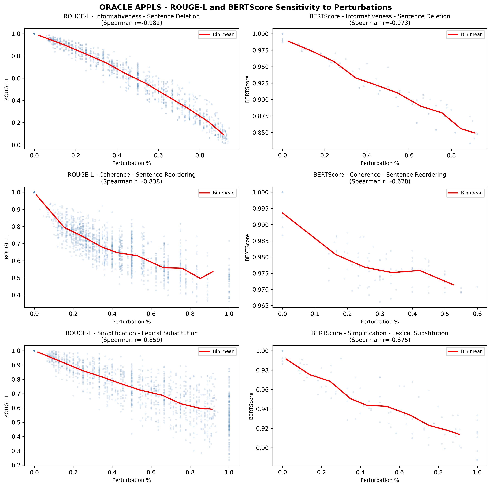

**Figure 9.** ROUGE-L and BERTScore correlation with APPLS perturbation severity across all three perturbation types.

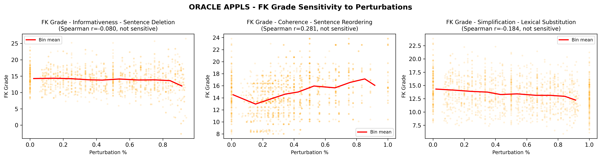

**Figure 10.** FK grade correlation with APPLS perturbation severity, shown separately to illustrate its substantially weaker sensitivity relative to Figure 9.

### 5.6 Limitations of the Literacy Proxy

Full-text (question plus answer) FK scoring changes routing correctness for 17.4% of queries overall compared to question-only scoring, but this overall figure obscures a sharply uneven distribution: PLABA (58.3%) and MedQA (42.0%) are far more sensitive to this scoring choice than MedMCQA (1.0%), Mirage (6.0%), PubMed (0.0%), or PubMedQA (0.0%). This limitation should be scoped to PLABA and MedQA specifically, not stated as a corpus-wide risk. The mechanism is confirmed directly: query length correlates with flip likelihood (point-biserial r=0.519, p<0.00001, n=523), so longer queries are substantially more likely to have their routing decision change under full-text versus question-only scoring. No evidence in this evaluation indicates that misrouted queries produce worse generation quality by the content metrics tested (Section 5.3); this is reported plainly as an absence of detected harm, not as confirmation that misrouting is harmless.

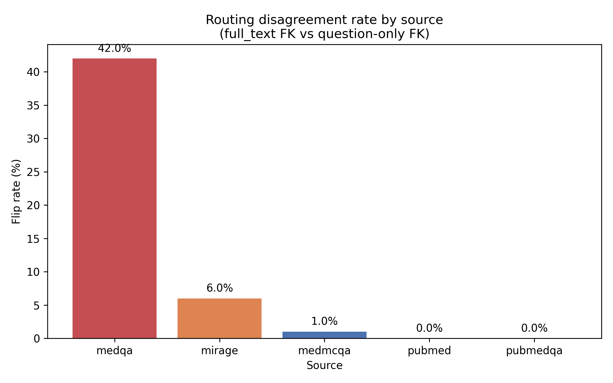

**Figure 11.** Proportion of queries whose routing decision changes between full-text and question-only FK scoring, by source. PLABA and MedQA are substantially more sensitive to this scoring choice than the other four sources.

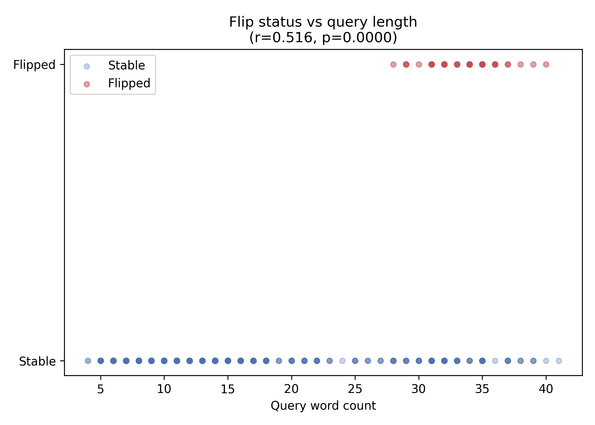

**Figure 12.** Relationship between query word count and the likelihood that full-text scoring flips the routing decision relative to question-only scoring (point-biserial r=0.519, p<0.00001).

## 6. Discussion

### 6.1 What Literacy Conditioning Actually Affects

The central finding of this evaluation is precise rather than sweeping: correct literacy-band routing significantly improves generation readability (Section 5.3, p=0.0018), and produces no detectable effect on retrieval relevance or generation content fidelity by the metrics available here. This is a stronger, more defensible claim than an unbounded assertion that routing accuracy matters generally, because it identifies specifically which stage of the pipeline literacy conditioning influences and which stage it does not.

A related question, what drives retrieval quality within a literacy band once routing is correct, surfaced a genuine anomaly this evaluation could not fully resolve. Within the low-literacy band, self-retrieval precision varies sharply by source: Mirage retrieves its own source record at 0.966 precision, while MedMCQA, the band's dominant source by volume, retrieves at only 0.816. Two natural explanations were tested directly and both were rejected. Mirage's advantage is not explained by MedMCQA simply dominating the band's aggregate statistics, since Mirage's own within-band score is measured independently of MedMCQA's. It is also not explained by question length: MedMCQA and Mirage have nearly identical median question lengths in this band (7 and 8 words respectively), yet their retrieval precision differs by 15 percentage points. This is reported as a genuine open question rather than resolved with a plausible but untested explanation; a source-level property of Mirage's questions, beyond length or volume, appears to make them more distinctly retrievable, and identifying that property is a direction for future work rather than a settled finding of this paper.

### 6.2 Metric Suite Validation as a Contribution

APPLS's own original finding, that no single readability or content metric captures every dimension of plain-language quality, now has direct empirical support on this paper's own data (Section 5.5) rather than resting on citation-based justification alone. ROUGE-L and BERTScore show strong, consistent sensitivity to the informativeness, coherence, and simplification perturbations APPLS defines; FK shows only a weak, sample-size-dependent signal for the same perturbations. Reporting FK, SMOG, ROUGE-L, and BERTScore together, rather than treating any one as sufficient, is therefore a methodologically necessary design choice for this evaluation, not merely a cautious one.

### 6.3 Production Deployment Implications

Clinical-professional content, MedMCQA, MedQA, and MIRAGE combined, makes up 94.8% of the retrieval corpus evaluated here. This paper's claims must be scoped accordingly: ORACLE demonstrates that literacy-band routing improves readability outcomes across the FK literacy spectrum this corpus covers, not specifically for lay patient populations, since patient-facing content (PLABA) is a small minority of the corpus and the corpus's one source of genuinely patient-facing question-answer pairs, MedQuAD, is not currently included at all (Section 3.2).

FK's jargon-blindness is a second real production risk, not a solved problem. MedMCQA's short, dense clinical exam fragments are classified into the low-literacy band at a rate (80.3% of all low-band records) that has nothing to do with whether that content is actually appropriate for a low-literacy reader. A production deployment relying on FK-based routing alone would systematically misclassify this kind of content, and this evaluation does not correct for that; it documents the failure mode precisely so that a production implementation can address it deliberately, for example by supplementing FK with a jargon-density signal, rather than discovering the problem after deployment.

### 6.4 Limitations

FK as a literacy proxy is not validated against actual patient comprehension in this evaluation; it measures surface features, sentence length and syllable count, rather than vocabulary difficulty or domain-specific jargon load, and Section 5.6 documents a further, source-specific routing risk when full-text rather than question-only scoring is used. Estimating literacy band from a short conversational query is also a fundamentally noisier task than the standardized-instrument literacy measurement (Baker, 2006) this design conceptually extends.

MedQuAD, the one dataset in this space explicitly designed for patient-facing question answering, is excluded from the current corpus. A usable subset of approximately 16,407 non-null-answer records exists within the dataset; re-integrating it is identified as direct future work rather than attempted here (Section 3.2).

The PEFT/LoRA adapter architecture described in Section 3.4 was structurally validated but not trained to convergence, and its inference-time switching latency has not been benchmarked; this is a systems assumption embedded in a research architecture that has not yet been operationally tested.

Comprehension-outcome measurement, whether improved readability actually improves a reader's genuine understanding, is not attempted in this evaluation. What is reported here is a readability and content-fidelity proxy measurement; the paper does not claim, and should not be read as claiming, that readability improvement is equivalent to comprehension improvement. Validating that link would require human-subjects testing, which is identified as necessary future work rather than a gap this evaluation closes.

MIMIC-III integration, intended for a future clinical-to-patient comparison, remains at the design stage only; no loader or integration exists in the current codebase (Section 4.1).

## 7. Conclusion

Retrieval-augmented generation's literacy-agnostic design is a structural gap, not an incidental one: every major RAG architecture retrieves identically regardless of who is asking, and treating accessibility as a post-generation simplification step introduces the factual errors that motivated this paper's design in the first place. ORACLE addresses this at the point where it actually matters, conditioning retrieval itself on an estimated literacy band via hard candidate-pool selection, rather than filtering or re-ranking results after an undifferentiated search.

The central empirical contribution is precise rather than sweeping. Correct literacy-band routing significantly improves generation readability (p=0.0018); it produces no measurable effect on retrieval relevance or generation content fidelity by the metrics evaluated here. This bounded claim is more defensible than an unqualified assertion that routing accuracy matters generally, and it is reinforced by two further results reported honestly rather than smoothed into a cleaner narrative than the evidence supports: two independent factual-consistency metrics diverge substantially, traced to a genuine domain mismatch rather than a pipeline error, and a retrieval-quality anomaly within the low-literacy band survived two independent hypotheses tested against it and remains, correctly, an open question rather than a resolved one.

Several limitations bound what this evaluation can claim. FK's jargon-blindness is a real, unmitigated production risk. Comprehension-outcome measurement, the question of whether improved readability actually improves reader understanding, is not attempted here and should not be inferred from the readability results reported. MedQuAD, the corpus's most directly patient-facing candidate source, is not currently integrated. Future work should prioritize MedQuAD re-integration, human-subjects comprehension validation, and a systematic investigation of what makes Mirage's questions more reliably retrievable than their length or corpus share would predict.

## References

Attal, K., Ondov, B., & Demner-Fushman, D. (2023). A dataset for plain language adaptation of biomedical abstracts. *Scientific Data*, 10, 8.

Baker, D. W. (2006). The meaning and measure of health literacy. *Journal of General Internal Medicine*, 21(8), 878-883.

Guo, Y., August, T., Leroy, G., Cohen, T., & Wang, L. L. (2024). APPLS: Evaluating evaluation metrics for plain language summarization. In *Proceedings of the 2024 Conference on Empirical Methods in Natural Language Processing* (pp. 9194-9211).

Guo, Y., Chang, J. C., Antoniak, M., Bransom, E., Cohen, T., Wang, L., & August, T. (2024). Personalized jargon identification for enhanced interdisciplinary communication. In *Proceedings of the 2024 Conference of the North American Chapter of the Association for Computational Linguistics: Human Language Technologies* (Volume 1: Long Papers) (pp. 4535-4550).

Institute of Medicine. (2004). *Health literacy: A prescription to end confusion*. National Academies Press.

Izacard, G., & Grave, E. (2021). Leveraging passage retrieval with generative models for open domain question answering. In *Proceedings of the 16th Conference of the European Chapter of the Association for Computational Linguistics: Main Volume* (pp. 874-880). Association for Computational Linguistics.

Jin, D., Pan, E., Oufattole, N., Weng, W. H., Fang, H., & Szolovits, P. (2021). What disease does this patient have? A large-scale open domain question answering dataset from medical exams. *Applied Sciences*, 11(14), 6421.

Jin, Q., Dhingra, B., Liu, Z., Cohen, W. W., & Lu, X. (2019). PubMedQA: A dataset for biomedical research question answering. In *Proceedings of the 2019 Conference on Empirical Methods in Natural Language Processing* (EMNLP).

Karpukhin, V., Oğuz, B., Min, S., Lewis, P., Wu, L., Edunov, S., Chen, D., & Yih, W. (2020). Dense passage retrieval for open-domain question answering. In *Proceedings of the 2020 Conference on Empirical Methods in Natural Language Processing* (EMNLP), 6769-6781.

Lewis, P., Perez, E., Piktus, A., Petroni, F., Karpukhin, V., Goyal, N., Küttler, H., Lewis, M., Yih, W., Rocktäschel, T., Riedel, S., & Kiela, D. (2020). Retrieval-augmented generation for knowledge-intensive NLP tasks. *Advances in Neural Information Processing Systems*, 33, 9459-9474.

Nutbeam, D. (2000). Health literacy as a public health goal: A challenge for contemporary health education and communication strategies into the 21st century. *Health Promotion International*, 15(3), 259-267.

Pal, A., Umapathi, L. K., & Sankarasubbu, M. (2022). MedMCQA: A large-scale multi-subject multi-choice dataset for medical domain question answering. In *Proceedings of the Conference on Health, Inference, and Learning* (pp. 248-260).

Xiong, G., Jin, Q., Lu, Z., & Zhang, A. (2024). Benchmarking retrieval-augmented generation for medicine. In *Findings of the Association for Computational Linguistics: ACL 2024*.

You, Z., & Guo, Y. (2026). PlainQAFact: Retrieval-augmented factual consistency evaluation metric for biomedical plain language summarization. *Journal of Biomedical Informatics*, 178, 105019.
